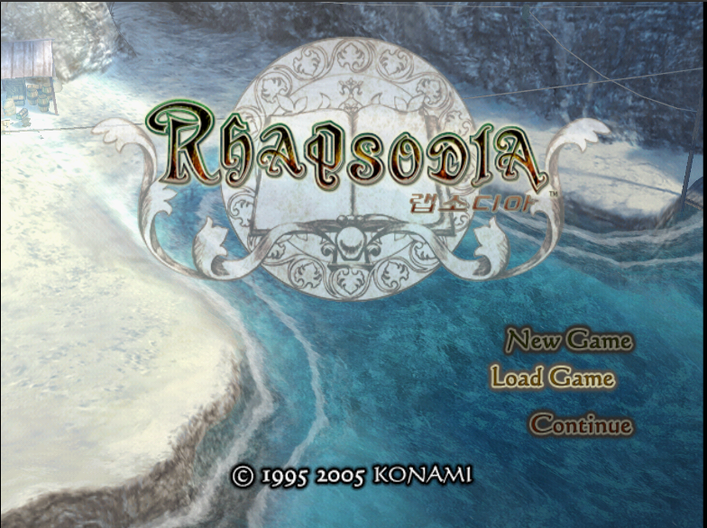

# 환상수호전 랩소디아 한국어 패치 (Suikoden Tactics / Rhapsodia Korean Patch)



PS2 일본판 幻想水滸伝ラプソディア (Genso Suikoden Rhapsodia)용 비공식 한국어 번역 패치입니다.
게임 ISO는 배포하지 않으며, 본인이 가진 원본 ISO에 적용하는 xdelta 차분 패치만 제공합니다.

> ⚠️ **패치는 반드시 아무것도 적용하지 않은 원본 ISO에 적용하세요.**

> **v0.5.0은 이야기를 엔딩까지 한 번 플레이하며 확인한 버전입니다.** 사이드 퀘스트와 일부 이벤트는 아직 직접 보지 못했고,
> 번역·표시 검수는 계속 진행 중입니다. 오역, 어색한 문구, 칸을 넘는 UI 등이 남아 있을 수 있습니다.

## 지원 원본

| 항목 | 값 |
|---|---|
| 게임 | 幻想水滸伝ラプソディア (일본판, SLPM-66105) |
| 파일 | 원본 ISO 이미지 1개 |
| 크기 | 1,425,506,304 바이트 |
| CRC32 | `A74A9503` |
| MD5 | `3b1099ab632a3d19d21fbd6e739b4989` |
| SHA-1 | `e29fead096ee46cb3b2bed6b262675c742719b53` |
| SHA-256 | `9de25dbabe1598af810a1dee5b9a94068ea25ce3876b80b67780edda774b1efc` |

해시가 다르면 패치가 적용되지 않거나 결과가 달라집니다. 적용 전에 원본 해시를 꼭 확인해 주세요.

## 패치 파일

| 파일 | 크기 | SHA-256 |
|---|---|---|
| `Rhapsodia_KR_v0.5.0.xdelta` | 3,801,819 바이트 | `d28bf28a576e9a450324a90f014932ed74c92ec81a6d3e0e2a54ccd62808d9a1` |

[Releases](../../releases)에서 받을 수 있습니다.

## 적용 방법

### xdelta UI / Delta Patcher (Windows)
1. `Rhapsodia_KR_v0.5.0.xdelta`를 받습니다.
2. xdelta UI 또는 Delta Patcher에서 **Patch**에 xdelta 파일, **Source**에 원본 ISO를 지정합니다.
3. 결과 파일 이름을 정하고 적용합니다.

### xdelta3 명령줄
```
xdelta3 -d -s 원본.iso Rhapsodia_KR_v0.5.0.xdelta 결과.iso
```

### 적용 결과 확인

| 항목 | 값 |
|---|---|
| 크기 | 1,425,506,304 바이트 |
| CRC32 | `F143A8EE` |
| SHA-256 | `055a05ec3bfb71e608b1203608398f68175d18674d7ef0abb449a2fe4e7f0733` |

## 현재 상태 (v0.5.0)

- 대사·선택지·메뉴·아이템·스킬·퀘스트 등 게임 내 텍스트를 한국어로 표시합니다.
- 오프닝·엔딩 서술, 편지, 장 제목, 전투 지명, 전투 안내 등 그림 속 글자도 한글로 바꿨습니다.
- 한글 표시를 위해 게임 실행 파일과 글꼴 자료 일부를 수정했습니다.
- 확인 환경: PCSX2 에뮬레이터. 실기(PS2)에서는 확인하지 않았습니다.

### 알려진 문제
- 사이드 퀘스트와 일부 이벤트(시메온 퀘스트 등)는 아직 직접 확인하지 못했습니다.
$L
- 치트로 「전투 즉시 승리」를 켠 채 마지막 장을 진행하면 이벤트 순서가 뒤바뀌고 인물 모델이 보이지 않을 수 있습니다. 치트를 끄고 진행해 주세요.

문제를 발견하면 Issues에 장면, 스크린샷, 사용한 에뮬레이터(또는 실기)를 함께 알려 주세요.

## 변경 이력

### v0.5.0 (2026-10-01)
- 첫 공개 릴리스. 이야기를 엔딩까지 한 번 플레이하며 확인했습니다.

## 글꼴

이 패치는 글꼴 파일을 담지 않고, 아래 글꼴로 미리 그린 글자 그림만 게임 자료에 넣었습니다.

| 쓰인 곳 | 글꼴 | 라이선스 |
|---|---|---|
| 대사·메뉴 본문 글자, 주인공 이름 | Noto Sans KR 2.004 | [SIL OFL 1.1](licenses/OFL-NotoSansKR.txt) |
| 전투 패널·상태 화면의 작은 글자 | 나눔고딕 Regular 3.020 | [SIL OFL 1.1](licenses/OFL-NanumGothic.txt) |

서술·편지 등 일부 그림 글자는 궁서체로 그린 정지 그림이며 글꼴 파일은 들어 있지 않습니다.

## 면책

- 이 프로젝트는 팬 번역이며 Konami와 관련이 없습니다.
- 幻想水滸伝(Suikoden)과 관련 상표·저작물의 권리는 각 권리자에게 있습니다.
- 게임 ISO, BIOS, 원본 데이터는 제공하지 않습니다. 본인이 소유한 원본으로만 사용해 주세요.
- 패치 사용으로 생긴 문제에 대해 책임지지 않습니다.
